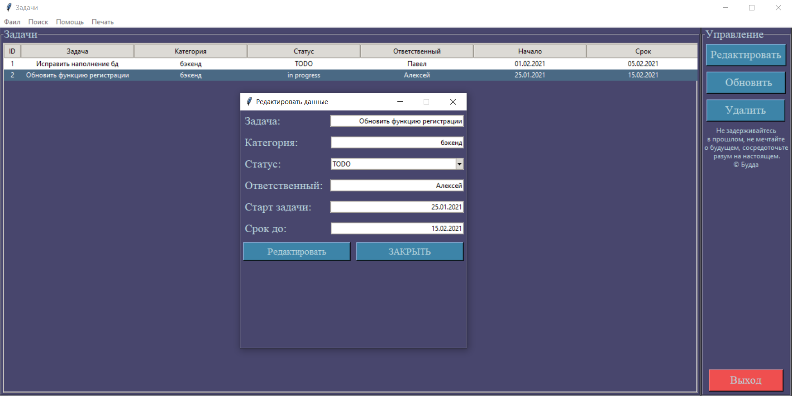

# TASK MANAGER ON TKINTER
A simple task manager with role allocation and progress changes.

Простой менеджер задач с разделением ролей. Ключевой особенностью данного приложения является то, что в нем использованы только внутренние возможности языка Python.

# Стек технологий.
* Python3.6 <
* Tkinter - создание и оформление окон приложения
* SQLite3 - для хранения данных в sqlite

Запуск приложения.
===
Основной файл - start.py

По умолчанию, чтобы войти в админ-панель есть супер пользователь: _login:admin, password:admin._

Во время использования приложения вы можете создать своего суперпользователя и удалить того, что по умолчанию.

О приложении.
===
Приложение было создано с целью понять возможности предустановленных инструментов языка Python в графическом оформлении окон приложений.
Может ли конкурировать библиотека Tkinter(без достановок и надстроек каких-либо модулей), по внешнему виду с современными модулями, например с таким, как QT.

Интерфейс
===

В приложении реализована возможность разделения ролей, а именно:
* Admin - может делать все что хочет))
* User - может только смотреть свои задачи и редактировать прогресс выполнения.

Admin - интерфейс.
===

Так же у администратора есть возможность просмотреть данные о всех пользователях.

Можно редактировать задачи в главном окне. Достаточно кликнуть по нужной строке в таблице и нажать на кнопку - **редактировать**.

Можно удалить задачу, кликнув по строке и нажать на **удалить**. Можно выделить сразу несколько задач для удаления. Так же работает и удаление пользователей, но есть оговорка - для удаления пользователя нужно, чтобы все связанные с ним задачи были удалены.

На случай, если пользователь забудет некоторые возможности приложения, есть вкладка помощь:

В приложении реализована возможность поиска среди задач:
* По категории

  
* По ФИО пользователя 

  
* Или же по названию задачи

  
  
Так же есть возможность выгрузки данных о задачах и сотрудниках в формате .txt

Users - интерфейс.
===

Функционал простых пользователей значительно урезан.

Итоги.
===

Конечно, Tkinter не сможет конкурировать с современными модулями в красоте, да и Python в принципе был создан не для этого.
Однако, если как следует изучить Tkinter, то его внешний вид, как минимум, не ударит лицом в грязь перед современными приложениями. Да, просто, и многих возможностей нет. Однако для простых приложений "для себя" его вполне хватит.

.
